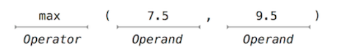
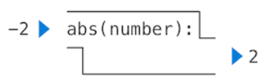
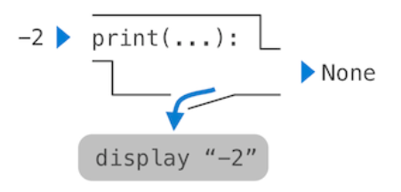

# Elements of Programming

Programming languages serve to organize ideas about computational processes and communicate them. They must **be written for humans to read, not just for machines to execute.**

Key Mechanisms of Every Powerful Languages:

- **Primitive expressions and statements**: Basic building blocks.
- **Means of combination**: Building compound elements from simpler ones.
- **Means of abstraction**: Naming and manipulating compound elements as units.

Functions and Data (Informally):

- **Data**: Stuff to manipulate.
- **Functions**: Rules for manipulating data.

A powerful language should describe primitive data and functions, and provide methods to combine and abstract them.

## Expressions

### Primitive expressions

One kind of primitive expression is a number:

```
>>> 42
42
```

### Compound expressions

Compound expressions are formed by combining numbers with mathematical operators

```
>>> -1 - -1
0
>>> 1/2 + 1/4 + 1/8 + 1/16 + 1/32 + 1/64 + 1/128
0.9921875
```

## Call expressions

**Call expression** is the most important kind of compound expression, applying a function to some arguments.

```
>>> max(7.5, 9.5)
9.5
```

This call expression has subexpressions: **the operator is an expression** that precedes parentheses, which enclose a comma-delimited list of **operand** expressions.



The order of call expression matters:

```
>>> pow(100, 2)
10000
>>> pow(2, 100)
1267650600228229401496703205376
```

Function notation has 3 principal advantaged over the mathematical convention of infix notation:

1. Function notation may take an arbitrary number of args (No ambiguity can arise, because the function name always precedes its arguments.)
2. Function notation extends in a straightforward way to **nested expressions** `>>> max(min(1, -2), min(pow(3, 5), -4)) -> -2`
3. Function notation may express any operator simply and directly

## Importing Library Functions

Python organizes functions into **modules**, which together comprise the Python **Library**. To use these elements, one imports them.

Example 1:

```
>>> from math import sqrt
>>> sqrt(256)
16.0
```

Example 2:

```
>>> from operator import add, sub, mul
>>> add(14, 28)
42
>>> sub(100, mul(7, add(8, 4)))
16
```

## Names and the Environment

**Names** bind to values using assignment statements.

```
>>> radius = 10
>>> radius
10
>>> 2 * radius
20
```

Names can also be bound to functions and reassigned.

The possibility of binding names to values and later retrieving those values by name means that the **interpreter must maintain some sort of memory that keeps track of the names, values, and bindings.** This memory is called an **environment.**

Functions, unlike numbers, are tricky to render as text, so Python prints an **identifying description** instead, when asked to describe a function:

```
>>> max
<built-in function max>
```

Names can also be bound to functions and reassigned:

```
>>> f = max
>>> f
<built-in function max>
>>> f(2, 3, 4)
4
```

And successive assignment statements can **rebind** a name to a new value.

```
>>> f = 2
>>> f
2
```

When a name is bound to a new value through assignment, it is no longer bound to any previous value:

```
>>> max = 5
>>> max
5
```

When executing an assignment statement, Python evaluates the expression to the right of = before changing the binding to the name on the left:

```
>>> x = 2
>>> x = x + 1
>>> x
3
```

***Changing the value of one name does not affect other names***.

```
>>> radius = 11
>>> area, circumference = pi * radius * radius, 2 * pi * radius
>>> area
314.1592653589793
>>> circumference
62.83185307179586
>>> radius = 11
>>> area
314.1592653589793
>>> area = pi * radius * radius
380.132711084365
```

## Evaluating Nested Expressions

The evaluation procedure is ***recursive*** in nature; that is, it includes, as one of its steps, the need to invoke the rule itself.

```
>>> sub(pow(2, add(1, 10)), pow(2, 5))
2016
```



This illustration is called an **expression tree**. In computer science, trees conventionally grow from the top down. The objects at each point in a tree are called **nodes**; in this case, they are expressions paired with their values.

> When we say that "a numeral evaluates to a number," we actually mean that the **Python interpreter evaluates a numeral to a number**. It is the interpreter which endows meaning to the programming language. Given that the interpreter is a fixed program that always behaves consistently, we can say that numerals (and expressions) themselves evaluate to values in the context of Python programs.

## The Non-Pure Print Function

Throughout this text, we will distinguish between two types of functions.

### Pure functions (纯函数)

```
>>> abs(-2)
2
```

The function `abs` is pure. Pure functions have the property that **applying them has no effects beyond returning a value**. Moreover, a pure function must **always return the same value when called twice with the same arguments.**


### Non-pure functions (非纯函数)

In addition to returning a value, applying a non-pure function can generate **side effects** (副作用), which make some change to the state of the interpreter or computer. A common side effect is to generate additional output beyond the return value, using the `print` function.

```
>>> print(1, 2, 3)
1 2 3
```

The value that `print` returns is always `None`, a special Python value that represents nothing. The interactive Python interpreter does not automatically print the value `None`. In the case of `print`, the function itself is printing output as a side effect of being called.



```
>>> print(print(1), print(2))
1
2
None None
```

The fact that it returns `None` means that it should not be the expression in an assignment statement.

```
>>> two = print(2)
2
>>> print(two)
None
```

### Advantages of pure funcs

1. Pure functions can be composed more reliably into compound call expressions.
2. Pure functions tend to be simpler to test. A list of arguments will always lead to the same return value, which can be compared to the expected return value.
3. Pure functions are essential for writing concurrent programs (并发编程) (Mentioned in Chapter 4)