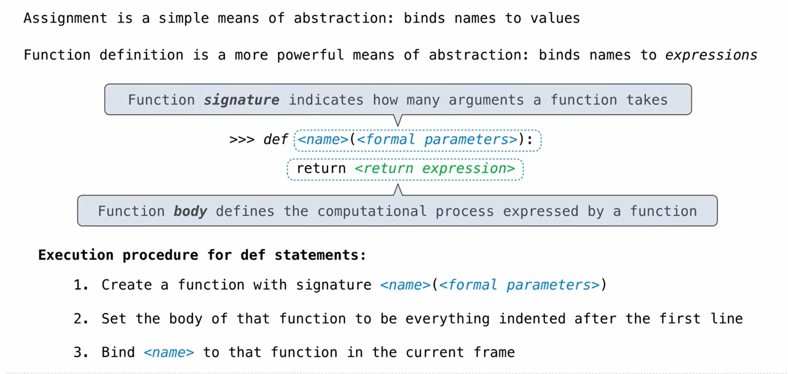
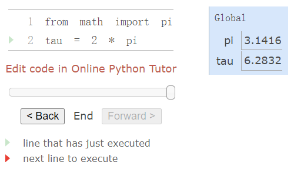
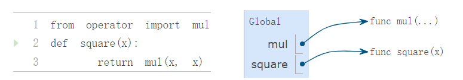
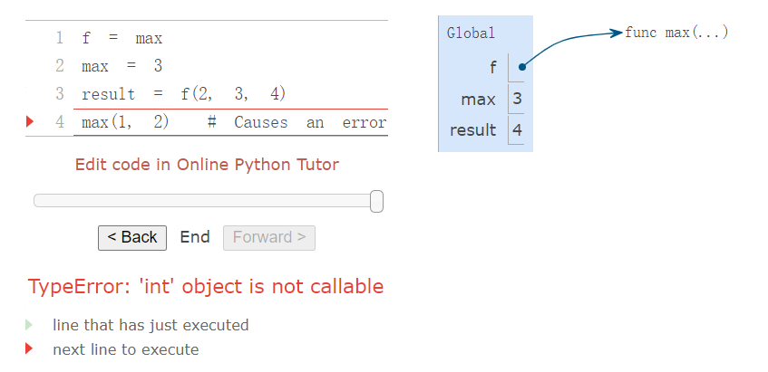
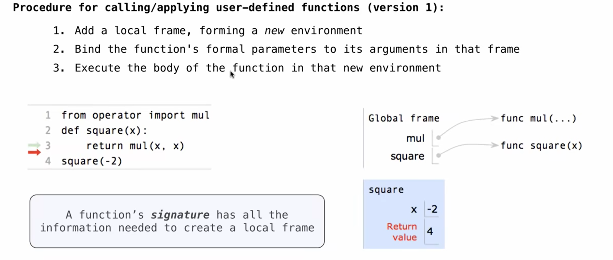

# Defining New Functions

Some of the elements that must appear in any powerful programming languages:
- Numbers and arithmetic operations are **primitive** built-in data values and functions
- Nested function application provides a means of **combining** operations
- Binding names to values provides a limited means of **abstraction**

## Function definition

**Function definition** is a powerful abstraction technique by which *a name can be bound to compound operation*, which can then be referred to as a **unit**.

### Function Definition Syntax

```
def <name>(<formal parameters>):
    return <return expression>

# example
def square(x):
    return mul(x, x)
```

- `def` keyword.
- Function name (`square`).
- Formal parameter (`x`).
- Function body 函数体 (`return mul(x, x)`).

> The `return expression` is not evaluated right away; it is stored as part of the newly defined function and evaluated only when the function is eventually applied.



### Function Call

After defining, functions can be called like built-in functions.

```
>>> square(21)
441
>>> square(add(2, 5))
49
>>> square(square(3))
81
```

### Using Functions within Functions

Functions can be used as building blocks for other functions

```
>>> def sum_squares(x, y):
        return add(square(x), square(y))

>>> sum_squares(3, 4)
25
```

### `def` and assignment statements both bind names to values

Both `def` statements and assignment statements bind names to values, and **any existing bindings are lost.**

```
>>> def g():
        return 1
>>> g()
1
>>> g = 2
>>> g
2
>>> g()
Traceback (most recent call last):
  File "<stdin>", line 1, in <module>
TypeError: 'int' object is not callable
>>> def g(h, i):
        return h + i
>>> g(1, 2)
3
```

## Environments

> Note
> When reading this section, it's better to access [Ch1.3-defining-new-functions](https://www.composingprograms.com/pages/13-defining-new-functions.html#environments) interactive web.

***An environment in which an expression is evaluated consists of a sequence of frames, depicted as boxes. Each frame contains bindings, each of which associates a name with its corresponding value. There is a single global frame. Assignment and import statements add entries to the first frame of the current environment. So far, our environment consists only of the global frame.*** 



### Environment Diagrams

Environment Diagrams:

- Consist of (1) the bindings of the current environment (2) the values to which names are bound.
- Global frame: where assignment and `import` statements add entries.
  - An `import` statement binds a name to a **built-in function**.
  - A `def` statement binds a name to a **user-defined function** created by the definition.

### Intrinsic name & Bound name



The name of a function is repeated twice, once in the frame and again as part of the function itself <当在编程语言（例如Python）中定义一个函数时，函数的名称会出现在两个地方：一个是全局帧（或其他相应的作用域）中，另一个是作为函数对象本身的一部分>:

- The name appearing in the function is called the **intrinsic name (内在名称)**.
- The name in a frame is a **bound name (绑定名称)**.
- There is a difference between the two: **different names may refer to the same function, but that function itself has only one intrinsic name.**
- The name bound to a function in a frame *is the one used during evaluation*. The intrinsic name of a function does not play a role in evaluation.



> The error message `TypeError: 'int' object is not callable` is reporting that the name `max` (currently bound to the number `3`) is an integer and not a function. Therefore, it cannot be used as the operator in a call expression.

### Function Signature

 A description of the formal parameters of a function is called the **function's signature (函数签名).**

The function `max` can take an arbitrary number of arguments. It is rendered as `max(...)`. Regardless of the number of arguments taken, all built-in functions will be rendered as `<name>(...)`, because these primitive functions were never explicitly defined.

## Calling User-Defined Functions

### Computational process of User-Defined Functions

To evaluate a call expression whose operator names a **user-defined function**, the Python interpreter follows a computational process:

1. Evaluate the operator and operand expressions, and then applies the named function to the resulting arguments.
2. Introduce locak frame, which is only accessible to that function
3. Bind the arguments to the names of the function's formal parameters in a new local frame
4. Execute the body of function in the environment that starts with frame
5. Each function application instance has its own independent local frame: first the local frame that contains formal parameter bindings, then the global frame that contains everything else

### Several steps of environment diagram

> [Execute in the Python Online Tutor](https://pythontutor.com/cp/composingprograms.html#code=from%20operator%20import%20mul%0Adef%20square%28x%29%3A%0A%20%20%20%20return%20mul%28x,%20x%29%0Asquare%28-2%29&cumulative=true&curInstr=0&mode=display&origin=composingprograms.js&py=3&rawInputLstJSON=%5B%5D)

```
from operator import mul
def square(x):
    return mul(x, x)
square(-2)
```



Step 1: Only the name `mul` is bound in the global frame
Step 2: The definition statement for the function `square` is executed (Notice that the entire `def` statement is processed in *a single step*. The body of a function is not executed until the function is called <not when it is defined>)
Step 3: The `square` function is **called** with the argument `-2`, and so a new frame is created with the formal parameter x bound to the value -2.
Step 4: The name `x` is looked up **in the current environment, which consists of the two frames shown**. In both occurrences, x evaluates to `-2`, and so the square function returns `4`.

> The `"Return value"` in the `square()` frame is not a name binding; instead it indicates the value returned by the function call that created the frame.

Even in this simple example, two different environments are used. The top-level expression `square(-2)` is evaluated in the global environment, while the return expression mul(x, x) is evaluated in the environment created for by calling `square`. Both `x` and `mul` are bound in this environment, but in different frames.

### Name Evaluation

A name evaluates to the value bound to that name in the earliest frame of the current environment in which that name is found. (环境中寻找该名称，最早找到的含有该名称的帧，其里边绑定的值就是这个名称的计算结果)

Our conceptual framework of environments, names, and functions constitutes a model of evaluation; while some mechanical details are still unspecified (e.g., how a binding is implemented), our model does precisely and correctly describe **how the interpreter evaluates call expressions**. In Chapter 3 we will see how this model can serve as a blueprint for implementing a working interpreter for a programming language.
（环境、名称和函数的概念框架构成了求解模型，虽然一些机械细节仍未指定（例如，如何实现绑定），但我们的模型确实精准地描述了解释器如何求解调用表达式。在第三章中，我们将看到这个模型如何作为蓝图来实现编程语言的工作解释器）

## Example: Calling a User-Defined Function

> 这部分写的太奇怪了，看书 1.3.3 吧

This example illustrates many of the fundamental ideas we have developed so far. Names are bound to values, which are distributed across many independent local frames, along with a single global frame that contains shared names. A new local frame is introduced every time a function is called, even if the same function is called twice.

All of this machinery exists to ensure that names resolve to the correct values at the correct times during program execution. This example illustrates why our model requires the complexity that we have introduced. **All three local frames contain a binding for the name x, but that name is bound to different values in different frames. Local frames keep these names separate.**

## Local Names

```
>>> def square(x):
        return mul(x, x)
>>> def square(y):
        return mul(y, y)
```